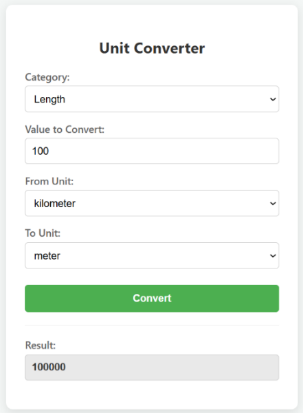

# Unit Conversion Web Application

A lightweight ASP.NET Core 8 Web API with a static HTML frontend for converting values across Length, Weight, and Temperature units.

## Tech Stack

- **Backend:** ASP.NET Core 8 Web API
- **Frontend:** Plain HTML/CSS/JavaScript (static file in `wwwroot`)
- **API Docs:** Swagger / OpenAPI (`Swashbuckle.AspNetCore 6.6.2`)


## Supported Units

| Category    | Units |
|-------------|-------|
| Length      | meter, kilometer, centimeter, millimeter, feet, inch, yard, mile |
| Weight      | kg, gm, milligram, pound, ounce |
| Temperature | celsius, fahrenheit, kelvin |

## API

### POST `/api/conversion/convert`

**Request body:**
```json
{
  "value": 100,
  "fromUnit": "meter",
  "toUnit": "feet"
}
```

**Response:**
```json
{
  "originalValue": 100,
  "fromUnit": "meter",
  "toUnit": "feet",
  "convertedValue": 328.084
}
```

**Error response (400):**
```json
{ "message": "Unsupported temperature unit: xyz" }
```


## Screenshot




